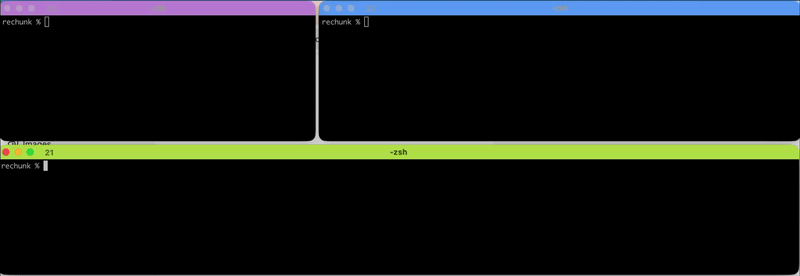
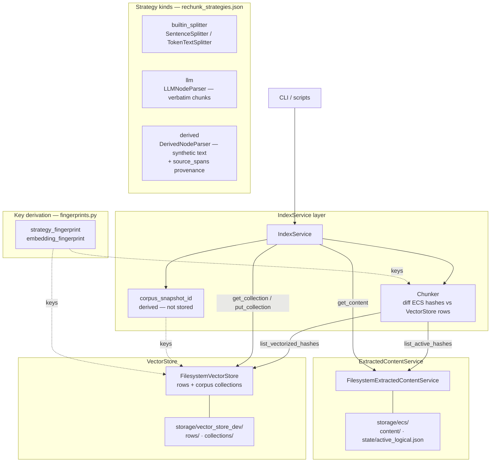
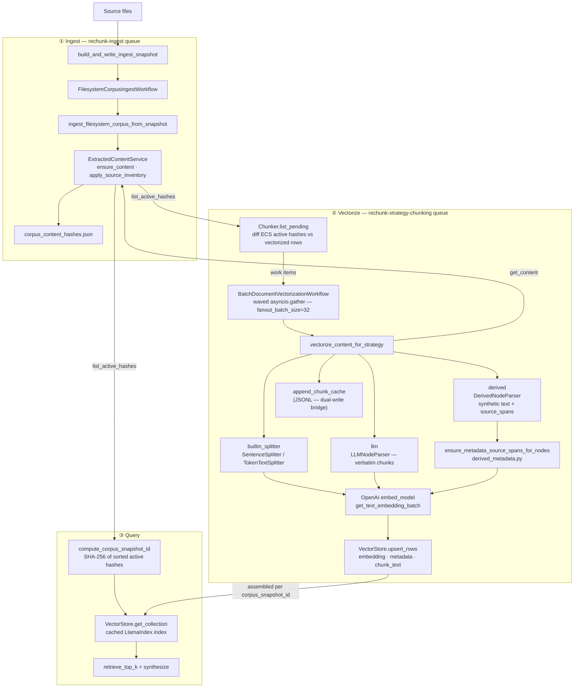
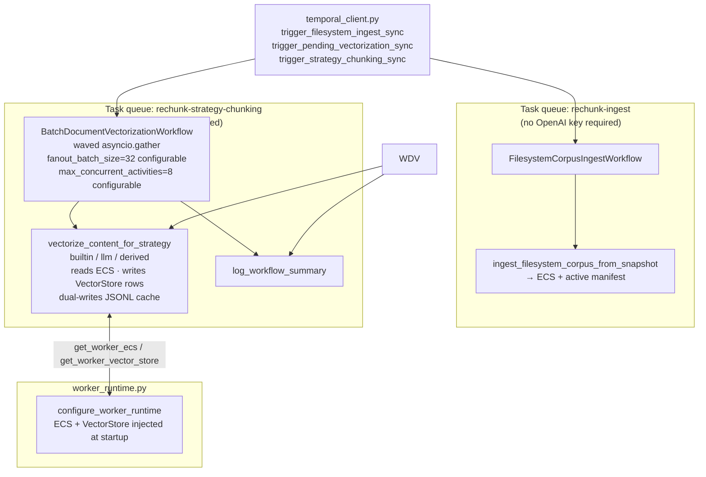

# ReChunk

**Adaptive, feedback-driven RAG chunking** — an extension for [LlamaIndex](https://www.llamaindex.ai/) that treats chunking as a living, strategy-driven process instead of a one-time split. Reliable re-indexing asynchronously via Temporal.

## About

Search over private data often underperforms. You know that feeling — you search for an email you know is there, or a particular section you clearly remember from an AI chat, and it eludes you. Each private corpus has idiosyncrasies never seen in public data, and little or no ground truth. A chunking strategy that works beautifully on one corpus fails silently on another.

The usual technique for embedding-based-search is to pick a chunking strategy at setup time and leave it. ReChunk takes a different view: the search index over a private corpus should be adaptive and respond to user feedback.

When retrieval produces a bad answer, ReChunk lets you change how your documents are chunked without a full reindex. New strategies run in parallel with existing ones. The system adapts to failure rather than silently compounding it. ReChunk extends tried-and-tested procedural chunking from LlamaIndex with custom chunks using an LLM itself, tuned to the specific structure of ideas in your corpus. Durable execution via Temporal ensures re-indexing is reliable and resumable at scale.

Built on [LlamaIndex](https://www.llamaindex.ai/) and [Temporal](https://temporal.io/).

ReChunk is still prototype code. Don't rely on it yet.

### At a glance

- **Index = f(corpus, S)** — the index is a pure function of your document corpus and a set of chunking strategies (S).
- **Strategy layers** — built-in splitters (no LLM), **LLM** strategies (verbatim, multi-span excerpts), and **derived** strategies (LLM-aided synthetic `content` + required `source_spans`). Chunks are tagged by strategy for multi-layer retrieval (v0.2+).
- **Feedback loop (roadmap)** — poor answers trigger diagnosis and proposal of new strategies.

**Derived chunks (high level):** Some strategies use `kind: "derived"` in `rechunk_strategies.json`. The LLM writes **synthetic** chunk text (summaries, bullet lists, obligation-style notes, etc.) optimized for retrieval. Still, every chunk must carry **`source_spans`**: character ranges into the real document so the chunk stays **grounded** and auditable. Rows and caches treat `metadata["source_spans"]` as canonical provenance; see `src/rechunk/derived_metadata.py`, `DerivedNodeParser` in `node_parser.py`, and `tests/test_derived_*.py` for behavior.

Optional **local** docs (not tracked in git): `rechunk_strategy.md` (design / roadmap), `REPOSITORY_DESCRIPTION.md` (GitHub *About* blurb), `TEMPORAL_IMPLEMENTATION_STEPS.md` (implementation checklist).

For coding agents and integration details, see **[AGENTS.md](AGENTS.md)**.

## Install

```bash
pip install -e .
# optional: dev + test deps
pip install -e ".[dev]"
```

Requires Python 3.10+. Set `OPENAI_API_KEY` for embeddings, LLM chunking, and CLI Q&A (or configure another LLM via LlamaIndex `Settings.llm`).

## Quick start (first run)

1. **Temporal** — install the [Temporal CLI](https://docs.temporal.io/cli) and start a dev server, e.g. `temporal server start-dev` (default address `localhost:7233`).
2. **Install the package** — from the repo root: `pip install -e ".[dev]"` (or `pip install -e .` for runtime only).
3. **Strategies file** — optional: add `rechunk_strategies.json` at the repo root; otherwise the CLI creates a sensible default on first use.
4. **API key** — `export OPENAI_API_KEY=...` in the shells where you run workers and interactive scripts.
5. **Sanity check** — `python scripts/rechunk_doctor.py` (use `--strict` in CI if you want failure when Temporal is down or the key is missing).
6. **Worker** — in one terminal: `python temporal_workers.py` (polls ingest + vectorization queues).
7. **Ingest + query** — in another: `python scripts/run_interactive.py path/to/your/docs` (ingests into ECS, queues vectorization, then Q&A). Or run ingest + chunking explicitly (see **Temporal** below).

**Common issues**

- **Empty or stale index** — worker not running, or vectorization still in flight; wait for workflows or check Temporal UI. Ensure the same `RECHUNK_OPENAI_EMBEDDING_MODEL` (if set) is used for workers and CLI index build.
- **Strategies file** — `rechunk_strategies.json` must exist and list the `strategy_id` you pass to chunking scripts; see the example file.

Environment variables are summarized in **AGENTS.md**.

## Run with your own docs

From the project root (with `OPENAI_API_KEY` set and the package installed, e.g. in a venv):

```bash
# Interactive helper: verifies Temporal + ReChunk workers first (prints steps if not); --skip-temporal-check to bypass
# If you omit the path, press Enter (or type demo) for a small Wikipedia subset, or enter your own path
python scripts/run_interactive.py path/to/your/docs
or just
python scripts/run_interactive.py
```


### Benchmark corpora (Wikipedia, CUAD, PG-19)

To pull **small subsets** from Hugging Face into a plain `.txt` tree (same shape as a normal `docs/` upload):

```bash
pip install -e ".[benchmark-corpora]"   # pins datasets<4 (required for script-based hubs like pg19)
python scripts/prepare_hf_benchmark_corpus.py wikipedia --n 200
python scripts/prepare_hf_benchmark_corpus.py cuad --n 40
python scripts/prepare_hf_benchmark_corpus.py pg19 --n 15 --split validation  # streams until n books; add --full-split to download whole split
```

Defaults write under `docs/benchmark_corpora/<preset>/`. See **`scripts/BENCHMARK_CORPORA.md`** for flags and ingest commands.

### Temporal (ingest vs vectorization)

Chunking/embeddings run in workers on **two task queues** (see `src/rechunk/temporal_queues.py`):

1. **`rechunk-ingest`** — `FilesystemCorpusIngestWorkflow`: corpus snapshot → ECS + hash manifest (no OpenAI embed required on this worker).
2. **`rechunk-strategy-chunking`** — `BatchDocumentVectorizationWorkflow` (one workflow, many activities per hash): read ECS, chunk, write VectorStore rows.

Run **`python temporal_workers.py`** to poll **both** queues in one process (local dev), or **`ingest`** / **`vectorization`** for split processes. Then:

```bash
python scripts/start_corpus_ingest.py path/to/docs --wait
python scripts/start_strategy_chunking.py s_default
```

### Strategy layers and union retrieval

- Each **strategy** (built-in splitter, LLM verbatim/multi-span, or **derived** synthetic + `source_spans`) produces its own **layer of chunks**:
  - Built-in: Sentence/Token splitters (no LLM) → chunks tagged with `metadata["strategy"] = "s_default"` / `"s_token"`, etc.
  - LLM: custom natural-language strategies → chunks tagged with their `strategy_id`.
  - Derived: synthetic `content` + required `source_spans` → same tagging; see **Derived chunks** under *At a glance* above.
- The index is built over the **union of all layers** (all chunks from all strategies).
- At query time, retrieval runs over this union, and the retrieval log shows, for each top‑k hit:
  - The **source document** and the **strategy id** (`strategy=<id>`) that produced that chunk.

### Quick demo



### Components


The main building blocks and how they relate. IndexService is the single entry point for clients; ExtractedContentService owns all document content; VectorStore holds the chunked, embedded rows and assembled retrieval indexes. Chunker and corpus_snapshot_id live inside the IndexService layer and are never called directly by clients.

### Data flow



How a document moves through the system end to end. Ingest and vectorization run on separate Temporal queues and can proceed independently. The three strategy kinds — builtin_splitter, llm, and derived — all converge on the same embedding and storage step. At query time, the active corpus is fingerprinted on the fly into a corpus_snapshot_id that keys the cached vector collection.

### Temporal layer



The two task queues and what runs on each. The ingest queue requires no API keys and only writes to ExtractedContentService. The vectorization queue requires OPENAI_API_KEY and runs ``vectorize_content_for_strategy`` (chunk + embed + VectorStore rows) under ``BatchDocumentVectorizationWorkflow``.

## Roadmap

### Product

| Milestone | Target |
|-----------|--------|
| **Prototype** | Done |
| **Benchmarking** | Mar 2026 |
| **Strategy balancing** | Apr 2026 |
| **Gradient descent in embedding space** | Apr 2026 |


## License

MIT
