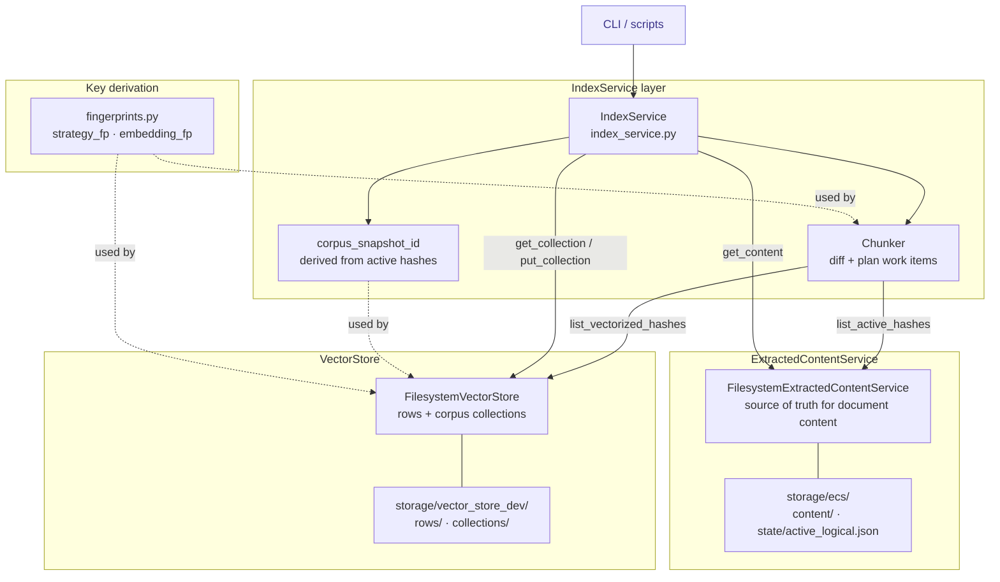

# ReChunk

**Adaptive, feedback-driven RAG chunking** — an extension for [LlamaIndex](https://www.llamaindex.ai/) that treats chunking as a living, strategy-driven process instead of a one-time split. Reliable re-indexing asynchronously via Temporal.

## About

Search over private data often qualitatively underperforms public. You know that feeling — you search for an email you know is there, and it eludes you. Each private corpus has idiosyncrasies never seen in public data, and little or no ground truth. A chunking strategy that works beautifully on one corpus fails silently on another.

The usual technique for embedding-based-search is to pick a chunking strategy at setup time and leave it. ReChunk takes a different view: chunking should be a feedback loop, responding to users' and teams' signals in near-real-time.

When retrieval produces a bad answer, ReChunk lets you change how your documents are chunked without a full reindex. New strategies run in parallel with existing ones. The system adapts to failure rather than silently compounding it. ReChunk can use tried-and-tested procedural chunking from LlamaIndex, which it extends — but it can also derive custom chunks using the LLM itself, tuned to the specific structure of ideas in your corpus. Durable execution via Temporal ensures re-indexing is reliable and resumable at scale.

Built on [LlamaIndex](https://www.llamaindex.ai/) and [Temporal](https://temporal.io/).

### At a glance

- **Index = f(corpus, S)** — the index is a pure function of your documents and a set of chunking strategies.
- **Strategy layers** — each strategy is a natural-language instruction; an LLM does the chunking. Chunks are tagged by strategy for multi-layer retrieval (v0.2+).
- **Feedback loop (roadmap)** — poor answers trigger diagnosis and, when the answer exists in the corpus, proposal of new strategies.

Optional **local** docs (not tracked in git): `rechunk_strategy.md` (design / roadmap), `REPOSITORY_DESCRIPTION.md` (GitHub *About* blurb), `TEMPORAL_IMPLEMENTATION_STEPS.md` (implementation checklist).

## Install

```bash
pip install -e .
```

Requires Python 3.10+. Optional: set `OPENAI_API_KEY` (or configure another LLM via LlamaIndex `Settings.llm`).

## Run with your own docs

From the project root (with `OPENAI_API_KEY` set and the package installed, e.g. in a venv):

```bash
# Interactive helper: prompts for a path if you omit it; ingests into ECS, queues embeddings (Temporal), then Q&A
python scripts/run_interactive.py
python scripts/run_interactive.py path/to/your/docs

# Chunk a directory of .txt files (or a single .txt file)
python scripts/run_with_docs.py path/to/your/docs

# Chunk and run a query (with retrieval + LLM feedback: chunks, scores, then answer)
python scripts/run_with_docs.py path/to/your/docs --query "What is the main idea?"

# Interactive: chunk once, then ask questions in a loop (feel how fast embedding retrieval is)
python scripts/run_with_docs.py path/to/your/docs --interactive
```

Use `docs` for the included sample. With `--query` or `--interactive`, the script shows **retrieval** (embedding cosine similarity, which chunks were picked, timing) and then the **LLM response** (synthesis from those chunks, timing). Options: `--strategy-id`, `--strategy`, `--model`, `--query`, `--interactive`, `--top-k`.

### Benchmark corpora (Wikipedia, CUAD, PG-19)

To pull **small subsets** from Hugging Face into a plain `.txt` tree (same shape as a normal `docs/` upload):

```bash
pip install -e ".[benchmark-corpora]"   # pins datasets<4 (required for script-based hubs like pg19)
python scripts/prepare_hf_benchmark_corpus.py wikipedia --n 200
python scripts/prepare_hf_benchmark_corpus.py cuad --n 40
python scripts/prepare_hf_benchmark_corpus.py pg19 --n 15 --split validation  # streams until n books; add --full-split to download whole split
```

Defaults write under `storage/benchmark_corpora/<preset>/`. See **`scripts/BENCHMARK_CORPORA.md`** for flags and ingest commands.

### Temporal (ingest vs vectorization)

Chunking/embeddings run in workers on **two task queues** (see `src/rechunk/temporal_queues.py`):

1. **`rechunk-ingest`** — `FilesystemCorpusIngestWorkflow`: corpus snapshot → ECS + hash manifest (no OpenAI embed required on this worker).
2. **`rechunk-strategy-chunking`** — `BatchDocumentVectorizationWorkflow` (one workflow, many activities per hash): read ECS, chunk, write VectorStore rows.

Run **`python temporal_workers.py`** to poll **both** queues in one process (local dev), or **`ingest`** / **`vectorization`** for split processes. Then:

```bash
python scripts/start_corpus_ingest.py path/to/docs --wait
python scripts/start_strategy_chunking.py s_default
```

### Strategy layers and union retrieval

- Each **strategy** (built-in splitter or LLM-based) produces its own **layer of chunks**:
  - Built-in: Sentence/Token splitters (no LLM) → chunks tagged with `metadata["strategy"] = "s_default"` / `"s_token"`, etc.
  - LLM: custom natural-language strategies → chunks tagged with their `strategy_id`.
- The index is built over the **union of all layers** (all chunks from all strategies).
- At query time, retrieval runs over this union, and the retrieval log shows, for each top‑k hit:
  - The **source document** and the **strategy id** (`strategy=<id>`) that produced that chunk.

### Quick demo


### System diagrams



## Roadmap

### Product

| Milestone | Target |
|-----------|--------|
| **Prototype** | Done |
| **Benchmarking** | Mar 2026 |
| **Strategy balancing** | Apr 2026 |
| **Gradient descent in embedding space** | Apr 2026 |

### Technical milestones

| Phase   | Milestone |
|---------|-----------|
| **v0.1** | `LLMNodeParser` — LLM-based chunking with a single strategy ✅ |
| **v0.2** | Multi-strategy index with layer tagging and union retrieval ✅ |
| v0.3 | Feedback signal ingestion and Branch A/B diagnosis |
| v0.4 | Automatic strategy proposal via LLM |
| v0.5 | Strategy hit tracking and pruning |
| v1.0 | Full feedback loop, LlamaIndex plugin packaging, docs |

## License

MIT
